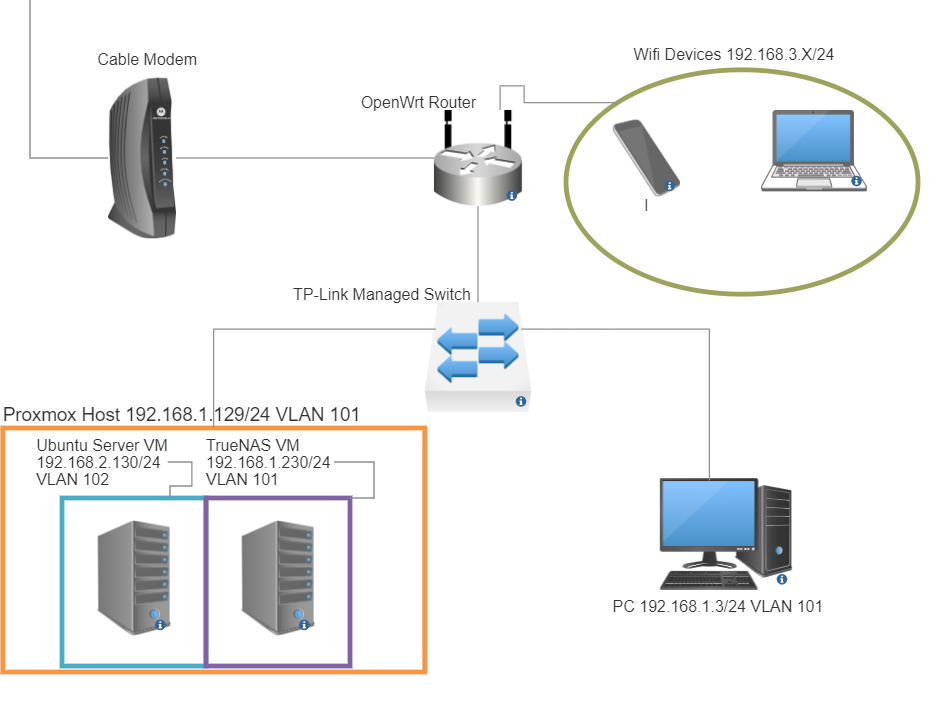

# Networking

## Router Firmware

After tinkering around with my router for a couple of days I quickly realized that it didn't seem to include many of the features that I needed for managing a secure home network. I saw the need to change that.

While researching solutions I stumbled upon firmware upgrades, specifically [OpenWrt](https://openwrt.org/start) and [DD-WRT](https://dd-wrt.com/) (WRT standing for 'wireless router') that included compatibility with many of the most common home routers. After researching both OpenWrt and DD-WRT, I went with OpenWrt primarily because the documentation seemed more accessible and it was compatible with my *TP-Link Archer A7*.

The firmware upgrade process was simple and the in-depth process and download can be found [here](https://openwrt.org/toh/tp-link/archer_a7_v5). The latest version when I installed OpenWrt was *ver. 22.03.3*, so that's the version I used. 

  - After logging into my router's management UI, all I had to do was navigate to *Advanced > System Tools > Firmware Upgrade*.

  - Once on the Firmware upgrade page, I downloaded *Firmware OpenWrt Install* from the link above and browsed for the new file from the webUI. 

  - After confirming that I selected the correct file I initiated the firmware upgrade process. CAUTION: Firmware upgrades are very sensitive, powering off the router or changing its settings can render the router useless.

  - Once the install process was complete I restarted my router and I was able to log in to the new OpenWrt WebUI!

## Network Configuration

#### Network Diagram

My basic network configuration consists of mostly wireless devices, and a few wired devices. The theory behind my network design is that VMs that are exposed to the internet via port forwarding (such as a minecraft server) should be separated from non-exposed machines and VMs. Wireless devices should also be in a separate network from wired management devices. The general idea is that segmented networks provide increased security and performance, especially when paired with firewall settings across clients and network devices. 
 
## Subnetting and VLANs

As shown in the above diagram, I prepared three 802.1Q VLANs and three different subnets on my home network. 

  - VLAN 101 192.168.1.X

    - This VLAN and subnet are for the *management* layer of my home network, which includes my main PC along with any services I provide to the local network. Systems on the management layer have access to any system on the network. At the time of writing, the Proxmox host, TrueNAS VM, and my primary PC are the only systems on VLAN 101.

  - VLAN 102 192.168.2.X
    - This VLAN and subnet are for the *services* my network provides. Any system with open ports exists on this network. Systems on this VLAN are also isolated from connecting to systems on other VLANs for additional security. At the time of writing only the Minecraft Server VM exists on VLAN 102. I would also place a web server on this VLAN if I wanted to.

  - VLAN 103 192.168.3.X
    - This VLAN is for devices connected to my network via wireless connections. Most devices on my network are connected to this VLAN because my family primarily accesses the internet through wireless connections. Wireless printers, IoT devices, and smartphones are all connected via VLAN 103. Devices on VLAN 103 are unable to connect to items on any other VLAN. Eventually, my goal is to split VLAN 103 into separate *guest*, *IoT*, and *trusted* networks to further improve security and accessibility for wireless devices on my network. 
